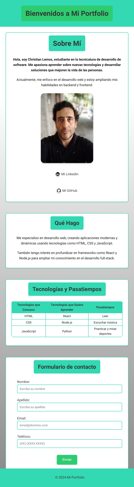

🐳 Ejecutar el portafolio en Docker

Requisitos

•	Tener instalado Docker Desktop

Pasos para correr el contenedor

1.	Clonar el repositorio:
git clone https://github.com/javito72/portfolio-contenedor.git
cd portfolio-contenedor

2.	Crear la imagen Docker:
docker build -t portfolio-web .

3.	Ejecutar el contenedor en segundo plano (modo detached):
docker run -d -p 8080:80 --name portfolio-container portfolio-web

4.	Abrí tu navegador y visitá:
http://localhost:8080

Puerto utilizado
•	Puerto del host: 8080
•	Puerto del contenedor: 80 (por defecto en Nginx)

# Práctica Formativa N°2
# Front End

## Segunda parte de mi portfolio, centrándome en desarrollar código HTML y CSS3 a través ## del programa Visual Studio Code.

 

